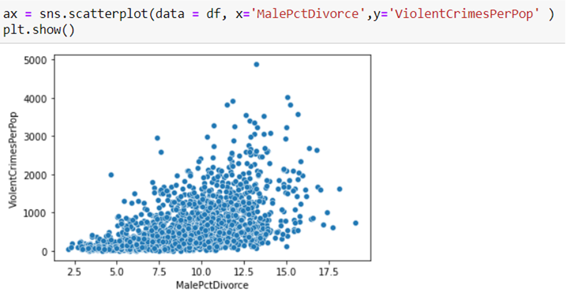
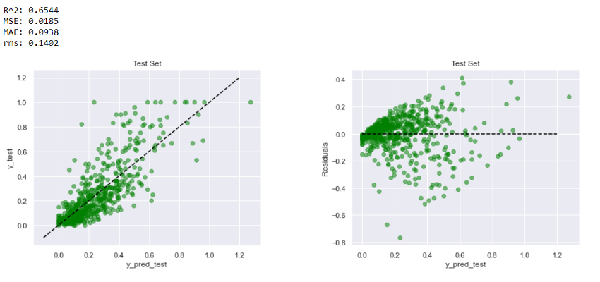

# Regression Analysis of Crime Data

This project analyzes crime data sourced from various resources to find patterns and trends in crimes. Additionally, it can be applied to increase efficiency in solving crimes. Several studies have discovered various techniques to solve the crimes that have many applications. Such a study can help speed up the process of solving crime and help manage the large volume of data generated which can be complex and difficult to manage.

The dataset is acquired from UCI machine learning repository website. The title of the dataset is ‘Crime and Communities’. It is prepared using real data from socio-economic data from 1990 US Census, law enforcement data from the 1990 US LEMAS survey, and crime data from the 1995 FBI UCR. This dataset contains a total number of 147 attributes and 2216 instances.

### Aim of the Project
In this project we seek to:
1.	Identify the variables that are the most highly correlated with the target
2.	Apply either dimensionality reduction or feature selection on the dataset
3.	Evaluate multiple regression algorithms to predict the crime rate.
4.	Compare the performance of each model & identify the best performing one.
5.	Present how your model generalizes and performs on unseen data.

### Implementation

* **Data Preprocessing:**   Dropped dependent and non predictive attributes. Some missing values were filled by a mean value using Imputer from sklearn.preprocessing. Lastly standardized the features by removing the mean and scaling to unit variance.
* **Experimentation:**   To familiarize ourselves with the dataset we used scatter plot to see the relationship between some attributes and Violent Crimes Per Population Attribute, which is our Goal Attribute. For example, Percentage of divorced males shows that low percentage of people in this age bracket corresponds with higher Violent Crimes.

* **Prediction:**  We used Linear Regression, Support Vector Regression, Decision Tree Regression, Random Forest Regression models and implemented Cross Validation on them. From Cross Validation scores, we saw that Linear Regression has the best performance among the analyzed models and will be used for generalization.

* **Result:** Feature ranking with recursive feature elimination showed to be the best method analyzed to select predictors of ViolentCrimesPerPop. The best generalization on the test set was obtained using a robust linear regression estimator (RANSAC).
